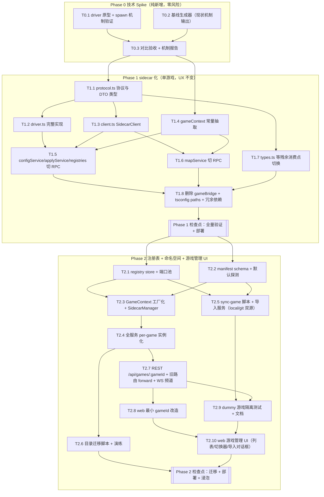

# 多游戏架构实施计划（Phase 0–2 任务级 / Phase 3–4 触发式概要）

> 面向未参与前期讨论的执行者：每个任务自包含。文中所有行号引用均为编写时的代码实况，执行前以现状为准复核。
> 本文档伴随 `docs/architecture.md`，落地后应将定型架构回写至该文档。

---

## 0. 全局约定与红线

### 0.1 红线（每个 Phase 验收时逐条核对）

| # | 红线 | 可执行的验证方式 |
|---|---|---|
| R1 | 本体仓 `../game_server_test` 零代码改动 | 每 Phase 结束执行 `cd ../game_server_test && git status --porcelain`，输出必须为空 |
| R2 | 线上宝塔常驻：server 重启必须用户确认；不擅自 kill/重启线上进程 | 部署动作清单中只有标注【需用户确认】的步骤涉及重启 |
| R3 | web 改动用 `pnpm --filter web run build-only` 生效，不重启服务 | 同上 |
| R4 | 对本体目录的唯一写路径：校验后落盘 `game/` + 自动备份 | 新代码不引入任何对 checkout 的写操作（sidecar driver 只读；sync 脚本只操作平台自己的 clone） |

### 0.2 全局技术约定（后续任务引用）

- **NDJSON 信封**：sidecar 走 stdio，每行一个 JSON。请求 `{ "id": <number>, "method": <string>, "params": <object> }`；响应 `{ "id": <number>, "ok": true, "result": <any> }` 或 `{ "id": <number>, "ok": false, "error": { "code": <string>, "message": <string> } }`。driver 的 **stdout 只允许协议帧**，一切诊断输出走 stderr。
- **错误码**：`bad_request`（参数形状错→REST 400）、`game_config_error`（校验不过/生成失败→422）、`driver_error`（driver 内部异常→500）、`unavailable`（进程 down 且重启失败→503）、`timeout`（→504）。
- **超时**：默认 15s；`buildMapGeometry` / `exportMapArtifacts` 60s。超时只返回错误帧，**不杀 driver**。
- **zod issue 形状**：`{ path: (string|number)[], message: string }[]`，driver 原样序列化 zod 的 `error.issues`（只取 path/message 两字段）。平台侧 `mapZodIssues`（`server/src/services/configService.ts:258-267`）**零改动复用**。
- **gameId**：默认游戏 id = `'gst'`（已拍板 Q5），"默认"语义用注册表 entry 上的 `isDefault: true` 标志表达（过渡期旧路由转发目标 + UI 初始选中），P3 删旧路由后可退役。Phase 1 代码里它是常量，Phase 2 变注册表 entry。
- **平台范围**：sidecar 本期只保 linux（已拍板 Q7），win32 记已知限制。
- **工作量标尺**：S < 0.5 天；M = 0.5–1.5 天；L = 2–4 天。不含联调等待。

---

## 1. 全计划依赖图

并行提示：T0.1 ∥ T0.2；T1.1 ∥ T1.4；T1.5 ∥ T1.6 ∥ T1.7；T2.1 ∥ T2.2；T2.4 ∥ T2.5；T2.6 ∥ T2.8。

---

## 2. Phase 0：技术 Spike（验证 sidecar spawn 机制）

**目标**：在不改任何现有架构的前提下，证明"平台仓 driver 文件 + cwd=本体 + 本体 tsconfig paths"可以完整替代当前进程内 import，输出逐字节一致。
**本 Phase 只新增文件，不修改、不删除任何现有文件；不触碰线上。**

### T0.1 driver 原型 + spawn 机制验证

1. **目标**：写出最小可用 driver，跑通 stdio RPC 与本体 tsconfig 解析。
2. **新增文件**：
   - `server/sidecar/driver.ts`（原型版，Phase 1 会扩写）
   - `scripts/spike-sidecar.mts`（spike 驱动脚本）
3. **关键实现要点**：
   - driver 原型实现 5 个方法：`ping`、`listRegistries`、`validateWhole`、`buildMapGeometry`、`validateFile`（后两个兼作协议形状验证）。
   - driver 内部 import 走本体别名：`import { bootstrapFramework, getRegistries, loadGameDefinition, buildMapGeometry, serializeGeometry } from 'framework'`，schema 从 `framework` 与 `framework/config/schema/ArchetypeSchema` 引入（复刻 `server/gameBridge/index.ts:11-25` 的引入路径，含"ArchetypeSchema/MapRegistrySchema 未走门面"的实况）。
   - **spawn 机制按优先级逐一试**（spike 脚本对候选 1/2 各跑一遍）：
     - 候选 1：`spawn(process.execPath, ['--import', 'tsx', driverPath], { cwd: <GAME_ROOT>, env: { ...process.env, TSX_TSCONFIG_PATH: <GAME_ROOT>/tsconfig.json } })`
     - 候选 2：`spawn('pnpm', ['exec', 'tsx', '--tsconfig', <GAME_ROOT>/tsconfig.json, driverPath], { cwd: <GAME_ROOT> })`
     - 候选 3（兜底记录，不必实现）：driver 内 `await import(pathToFileURL(<GAME_ROOT>/framework/index.ts).href)`——注意 barrel 内部别名仍需 tsx paths，所以 3 不能单独成立，只作记录。
   - driver 读到 `ping` 时额外返回：进程内 `zod` 版本（用 `createRequire(<GAME_ROOT>/framework/index.ts)` 解析 `zod/package.json` 的 version）——**预期 4.4.3（本体的），不是 server 的 4.6.5**，以此证明依赖单实例化。
   - NDJSON 读入：stdin `readline` 按行 `JSON.parse`，解析失败回 `{ id: null, ok:false, error:{code:'bad_request'} }`。
4. **前置依赖**：无。
5. **验证方式**：`pnpm exec tsx scripts/spike-sidecar.mts --phase=mechanics`，输出候选机制可用性、启动延迟（spawn→pong）、driver RSS。
6. **工作量/风险**：M。风险：tsx 的 `TSX_TSCONFIG_PATH`/`--tsconfig` 行为与 paths 相对 baseUrl 的解析（候选 1、2 至少通一个即可继续；都不通则升级讨论）。

### T0.2 基线生成器（用现状进程内机制产生"标准答案"）

1. **目标**：用**当前生产机制**（gameBridge 进程内 import）生成全部对比基线 JSON。
2. **新增文件**：`scripts/spike-baseline.mts`（必须从 `server/` 目录以 tsx 运行，使其加载 `server/tsconfig.json` 的 paths——这正是现状机制）。
3. **关键实现要点**：产出 `/tmp/opencode/spike/baseline.json`，内容：
   - `registries`：复刻 `server/src/routes/registries.ts:25-37` 逻辑（bootstrap + 五类 list，components 只取键、mapGenerators 只取 id）。
   - `wholeValid`：对 `../game_server_test/game/game.json` 调 `validateWholeConfig` 同款逻辑 → `{ ok, message }`。
   - `wholeInvalid`：把 `game/` 拷贝到 `/tmp/opencode/spike/broken-game/`，破坏 `game.json`（删一个必填键）→ 记录 `{ ok:false, message }` 原文。
   - `geometry`：读本体 `game/maps/registry.json`，对每个 `kind !== 'tiled'` 的 key 执行 `mapService.buildGeometry` 同款流程（含 tiledPath 内联，`mapService.ts:124-162`）→ `serializeGeometry` 结果。`tiled` 图记录其 400 报错文案。
   - `validateFile`：3 个用例——合法 `entities/wolf.json`（`{valid:true}`）；破坏版 archetype（删必填字段 → issues 数组）；非 schema 路由路径文件（对应 `routeSchemaKind` 返回 null 的语义，driver 侧应回 `bad_request` 或平台侧不问——见 T0.3 判定）。
4. **前置依赖**：无（与 T0.1 并行）。
5. **验证方式**：脚本运行成功且基线文件非空；人工抽查 `registries.systems.length` 与 `GET /api/registries` 线上/本地输出一致。
6. **工作量/风险**：M。风险：无（只读操作）。

### T0.3 对比验收 + 机制报告

1. **目标**：driver 输出与基线**规范化后逐字节一致**，并产出 spawn 机制定型结论。
2. **修改文件**：`scripts/spike-sidecar.mts`（补对比段）。
3. **关键实现要点**：
   - 规范化比较：`JSON.stringify(value, sortedKeysReplacer)`（递归按 key 排序的 replacer）后字符串相等判定；error message 做字符串全等。
   - 额外机制用例（只测语义，记录行为）：未知 method、畸形行、`kill -9` driver 后再发请求（client 错误路径，本阶段只需记录观察到的行为）、连续 100 次 `ping` 的 p50 延迟。
   - `validateFile` 对"未登记 kind"的语义在报告中给出建议取值（建议：平台侧 pattern 未命中根本不发 RPC；driver 收到未知 kind 回 `bad_request`）。
4. **前置依赖**：T0.1、T0.2。
5. **验证方式（Phase 0 验收标准）**：
   - `baseline.json` 与 `driver.json` 全键 diff 为空；
   - 候选 1 或 2 至少一个可用，报告写明定型选择；
   - driver 内 zod 版本 = 4.4.3（与 `game_server_test/node_modules/zod` 一致）；
   - `cd ../game_server_test && git status --porcelain` 为空（R1）。
6. **工作量/风险**：S。风险：低。
7. **产出物（Phase 0 → Phase 1 的交接）**：spawn 机制定型记录、协议字段实测样例、延迟基线数据。

**Phase 0 线上部署动作**：无（全部离线脚本）。

---

## 3. Phase 1：sidecar 化 + 消灭编译期耦合（单游戏，UX 完全不变）

**目标**：4 簇 gameBridge 消费点全部改走 sidecar RPC；删除跨仓 tsconfig paths 与 gameBridge；对外 REST/WS/页面行为逐点不变。
**总体验收后只重启 server【需用户确认】，web 不动。**

### T1.1 protocol.ts —— 协议与 DTO 类型

1. **目标**：定义 sidecar 协议类型与全部 DTO，取代对本体类型的 import。
2. **新增文件**：`server/src/sidecar/protocol.ts`。
3. **关键实现要点**：
   - 信封类型（§0.2 格式）；`SidecarRequest` / `SidecarResponse` / `SidecarErrorCode`。
   - 方法参数/结果类型：`ListRegistriesResult`（对齐 `RegistriesPayload`，`server/src/types.ts`）、`ValidateFileParams { kind, data }` / `{ valid, issues }`、`ValidateWholeParams { gameJsonPath }` / `{ ok, message }`、`BuildMapGeometryParams { config }` / `SerializedMapGeometry`、`ExportMapArtifactsParams { config, palette? }` / `{ dir, jsonPath, pngPath }`。
   - `SerializedMapGeometry`、`MapGenerationConfig`、`TilePalette` 等**按形状重写**（当前经 `server/gameBridge/index.ts:39-52` 从本体 re-export；重写时以 `server/src/types.ts` 与 mapService 实际消费字段为准，先写最小字段集，TypeScript 结构类型自然兼容）。
4. **前置依赖**：T0.3（协议样例实测）。
5. **验证方式**：`pnpm --filter server run check`（此时新文件未被引用，仅要求编译通过）。
6. **工作量/风险**：S。风险：低。

### T1.2 driver.ts —— 完整实现

1. **目标**：覆盖全部 6 个 RPC 方法的 driver 正式版。
2. **修改文件**：`server/sidecar/driver.ts`（原型扩写）。
3. **关键实现要点**：
   - 方法表：`ping`（含 zod 版本与 framework 自检）、`listRegistries`、`validateFile`、`validateWhole`、`buildMapGeometry`、`exportMapArtifacts`。
   - **schema kind 表迁入 driver**：`{ GameDefinition, Archetype, MapRegistry, combat, needs, crafting, daynight, server }` 8 个 kind → zod schema 的映射（即 `configService.ts:49-58` 的 `SCHEMA_TABLE` 内容搬入 driver；平台侧从此不持有任何 zod 对象）。
   - `validateFile`：`schema.safeParse(params.data)`，失败时 issues 映射为 `{ path, message }`（path 过滤掉 symbol，实测 zod 只产生 string|number）。
   - `validateWhole`：复刻 `server/gameBridge/validate.ts:34-51`，**含存在性预检**（`existsSync` 先于 `loadGameDefinition`，否则静默回退默认定义会误报通过——注释 L30-32 的坑）。
   - `buildMapGeometry`：`bootstrapFramework()` 首次调用时自举一次（幂等，对应现状 mapService.ts:129 的每次调用——driver 常驻后可只在首调用做）；成功后 `serializeGeometry` 再返回（序列化放 driver 内，平台不再接触 `MapGeometry` 类实例）。
   - `exportMapArtifacts`：调 `exportGeometryArtifacts` 写 `os.tmpdir()` 下 `admin-map-export-<uuid>/`（保持 mapService.ts:96 的现命名），返回路径三元组；同机共享 fs，清理责任仍在平台路由层（现状语义不变）。
   - 串行处理请求（逐行 await，不并发）——framework 全局单例语义下最稳。
   - 一切 `console.*`/诊断写 stderr；stdout 只写响应帧。
4. **前置依赖**：T1.1。
5. **验证方式**：重跑 `scripts/spike-sidecar.mts` 对比模式（方法扩到 6 个），与基线一致。
6. **工作量/风险**：M。风险：`exportGeometryArtifacts` 的 PNG 生成若依赖 native 模块，需确认在 driver 进程可用（本体 node_modules 内解析，预期无碍）。

### T1.3 client.ts —— SidecarClient

1. **目标**：平台侧的 driver 进程管理者与 RPC 客户端。
2. **新增文件**：`server/src/sidecar/client.ts`。
3. **关键实现要点**：
   - 生命周期：**lazy start**（首个 RPC 才 spawn）；exit → 下次 RPC 自动重启一次；**连续 2 次 spawn 失败 → `unavailable`，不再自动重试**（防 crash loop），提供显式 `restart()`。
   - spawn 用 T0.3 定型的机制；cwd = 当前 GAME_ROOT（本 Phase 仍是 `config.ts:27-29` 的值）。
   - NDJSON：id 自增，pending map `id → {resolve, reject, timer}`；stdout 半行缓冲按行拆（可复用 `instanceManager.ts:324-344` 的同款思路）；stderr 行转发到 `console`（本 Phase 不接 logStream，Phase 2 再说）。
   - 超时：默认 15s，`buildMapGeometry`/`exportMapArtifacts` 60s；超时 reject `timeout`，**不杀进程**。
   - 请求串行化：client 内部 promise 链（与 driver 串行处理对齐，避免 pending 乱序复杂度）。
   - 管理后端退出时 SIGTERM driver（`process.on('exit')` 注册）——driver 是计算附属物，不留孤儿（与游戏实例的"独立存活"语义相反，注意别抄 instanceManager 的退出行为）。
   - **本期只保 linux**（Q7 已拍板）；win32 spawn 差异记为已知限制（README/文档注明）。
4. **前置依赖**：T1.1。
5. **验证方式**：单元级手测——写临时脚本连续调 100 次 `ping` 无泄漏；`kill -9` driver 后下一次调用自动重启成功；连续两次把 GAME_ROOT 指到无效路径触发 `unavailable`。
6. **工作量/风险**：M。风险：进程泄漏（exit 钩子遗漏）；win32 spawn 差异（本期不覆盖）。

### T1.4 gameContext —— 散落常量的单一出口

1. **目标**：把所有"游戏特化"硬编码抽成一个上下文对象，Phase 2 工厂化时不返工。
2. **新增文件**：`server/src/gameContext.ts`。
   **修改文件**：`server/src/config.ts`、`server/src/services/instanceManager.ts`、`server/src/services/saveService.ts`、`server/src/services/logStream.ts`、`server/src/services/liveState.ts`（仅常量出处替换，行为不变）。
3. **关键实现要点**：
   - 定义 `interface GameContext { gameId, gameRoot, gameConfigsDir, gameLogsDir, gameLogFile, savesDir, envFile, ports: { official, preview }, start: { command, args }, envInjection: { port, configPath, saveDir }, schemaRoutes: SchemaRoute[], roomName }`，导出 `const defaultGameContext: GameContext`（gameId `'gst'`）。
   - `schemaRoutes` 用数据表达 `configService.ts:61-69` 的正则路由表（pattern 字符串 + kind；`rules/(combat|...)` 的 kind 捕获用 `"*"` 语义表示"kind=文件名"）；`routeSchemaKind` 改为纯函数读这份数据，匹配逻辑逐行保留。
   - `instanceManager.ts:136-142` 的 `PORT`/`GAME_CONFIG_PATH`/`SAVE_DIR` 改从 `envInjection` 读；`instanceManager.ts:166-168` 的 `pnpm dev` 改从 `start` 读；`rolePort`（config.ts:75-77）改由 context.ports 提供。
   - `liveState` 房间名 `'game'`（web 端在 `connection.ts:72`，server 端 join 在 liveState——两侧本 Phase 都仍用常量，但 server 侧出处改为 context.roomName）。
   - `config.ts` 保留原导出名（`GAME_ROOT` 等）但从 defaultGameContext 取值——**本文件成为兼容壳**，减少 diff 面。
4. **前置依赖**：无（∥ T1.1–T1.3）。
5. **验证方式**：`pnpm check:all`；双实例启停、预览注入（`configPath`/`saveDir` 出现在实例 snapshot，REST `GET /api/instances/preview` 可见）、日志流、存档列表——逐项与改动前一致。
6. **工作量/风险**：M。风险：漏抽某处硬编码导致 Phase 2 返工——完成标准加一条：`grep -rn "GAME_ROOT\|gameConfigsDir\|gameLogFile" server/src` 的出处全部收敛到 gameContext。

### T1.5 configService + applyService + registries 路由切 RPC

1. **目标**：第 1、2、4 簇消费点（单文件校验、整体校验、注册表）切换到 sidecar。
2. **修改文件**：`server/src/services/configService.ts`、`server/src/services/applyService.ts`（L28 的 import 与调用点）、`server/src/routes/registries.ts`。
3. **关键实现要点**：
   - 删 `configService.ts:22-32` 的 gameBridge import 与 `SCHEMA_TABLE`（L49-58）；`writeFile`（L165）与 `validateFile`（L203）的 `schema.safeParse` 改为 `await sidecar.validateFile({ kind, data: parsed })`——**service 方法全部 async 化**（签名变化，检查路由层调用点）。
   - issues → `mapZodIssues`（L258）入参形状与现状一致（T1.2 已保证），**本函数一行不改**。
   - `validateAll`（L213-217）改 `await sidecar.validateWhole({ gameJsonPath })`；applyService 的 `validateWholeConfig` 调用同步替换。
   - `registries.ts:25-36` 改一次 `await sidecar.listRegistries()`，payload 组装逻辑（components 取键、generators 取 id 的裁剪属于游戏侧语义）**移入 driver**，路由层透传。
   - driver `unavailable` → REST 503；`game_config_error` → 422 带 message（对齐现状 `ValidationFailedError` 与 mapService 的 422 语义）。
4. **前置依赖**：T1.2、T1.3、T1.4。
5. **验证方式**：配置编辑页——保存合法文件通过；保存破坏文件出现**与线上一致的**错误定位回显（jsonPath + 行号）；整体校验按钮；注册表页五类清单与 `GET /api/registries` 改动前输出 diff 为空；落盘 diff → 校验终门 → 写回 → 回滚全链路。
6. **工作量/风险**：M。风险：async 化遗漏调用点（`pnpm --filter server run check` 可全查出）。

### T1.6 mapService 切 RPC

1. **目标**：第 3 簇（地图几何）切换。
2. **修改文件**：`server/src/services/mapService.ts`。
3. **关键实现要点**：
   - 删 L15-21 的 gameBridge import；`buildGeometry`（L124-178）中 **tiledPath 内联等文件 I/O 全部保留在平台侧**（L131-162 不动），最终 `config` 送 `sidecar.buildMapGeometry({ config })`，直接拿 `SerializedMapGeometry`（删去 L75 的本地 `serializeGeometry` 调用——已移入 driver）。
   - `exportMap`（L82-107）改 `sidecar.exportMapArtifacts`，临时目录清理责任不变（路由层）。
   - `bootstrapFramework()` 调用点（L129）删除（driver 内部自举）。
   - 错误映射：driver `game_config_error` → `WorkspaceError(422, ...)`（保持 L173-177 的现语义与文案格式）。
4. **前置依赖**：T1.2、T1.3、T1.4。
5. **验证方式**：地图页——pipeline 图预览与改动前渲染一致；PNG/JSON 导出下载正常；tiled 图 400 报错文案一致；工作区/本体双源切换正常。
6. **工作量/风险**：M（∥ T1.5）。风险：`MapGenerationConfig` 经 JSON 往返后字段丢失（如函数/undefined）——T0.2 基线已含 geometry 对比，回归用它兜底。

### T1.7 types.ts 等残余消费点切换

1. **目标**：清除 gameBridge 的最后引用（纯类型）。
2. **修改文件**：`server/src/types.ts` 及 `grep -rn "gameBridge" server/src` 的全部残余命中文件。
3. **关键实现要点**：类型来源统一改 `sidecar/protocol.ts`；`import type` 无运行时影响，注意循环依赖（protocol.ts 不得 import types.ts——DTO 自包含）。
4. **前置依赖**：T1.1。
5. **验证方式**：`grep -rn "gameBridge" server/` 命中为 0；`pnpm --filter server run check`。
6. **工作量/风险**：S。风险：低。

### T1.8 删除 gameBridge + tsconfig 解耦 + 依赖瘦身

1. **目标**：物理删除跨仓编译耦合（本 Phase 的"正题"）。
2. **删除文件/位置**：
   - `server/gameBridge/`（index.ts + validate.ts 整个目录）；
   - `server/tsconfig.json:15-42`——全部 12 条跨仓 paths 与 `include` 中的 `../../game_server_test/framework/bitecs-legacy.d.ts`，`baseUrl`/paths 段可整体移除；
   - `server/package.json` 依赖中的 `bitecs`、`check2d`、`mistreevous`（**先 grep 验证**：`grep -rn "from 'bitecs'\|from 'check2d'\|from 'mistreevous'" server/src` 必须无命中——前期侦察已确认，落刀前再验一次）；`zod`/`winston` 同样 grep 后决定去留（zod 若 server 自身无 import 也删——注意 protocol.ts 只用了结构类型）。
3. **关键实现要点**：删依赖后 `pnpm install` 刷新 lockfile；确认 tsx 运行时不再误解析旧 paths（重启 server 后 `GET /api/registries` 正常即证）。
4. **前置依赖**：T1.5、T1.6、T1.7 全部验证绿。
5. **验证方式**：`pnpm check:all` 全绿（schema:check、lint、类型、测试、构建）；R1 红线核对。
6. **工作量/风险**：S。风险：漏删引用导致编译失败——编译器会全部报出，无静默风险。

### Phase 1 检查点（验收标准 + 部署动作）

**验收标准**（全量人工闭环，对照 README 八大域）：
1. `pnpm check:all` 绿；
2. 工作区：新建/切换/变更计数正常；
3. 配置编辑：保存校验、错误定位回显、整体校验——**与改动前截图/文案一致**；
4. 落盘：diff 审查 → 校验终门 → 备份 → 写回 → 回滚；
5. 地图：预览、双源对比、PNG/JSON 导出；
6. 存档：列表/详情/删除/下载/恢复；
7. 注册表：五类清单与 `cd ../game_server_test && pnpm tools list-registries` 数量一致（registries.ts 头注释的验收基准沿用）；
8. 实例：official/preview 启停、状态机、日志流、崩溃归因；
9. 观察页：PlayView 渲染、ECharts 趋势（liveState 未动，回归即可）；
10. R1：`cd ../game_server_test && git status --porcelain` 为空；
11. sidecar 专项：driver 进程随首个 RPC 拉起；`kill -9` 后下一次调用自动恢复；admin 退出后无 driver 孤儿进程（`pgrep -f sidecar`）。

**线上部署动作清单**：
1. 【需用户确认】通过管理页停止 official/preview 实例（避免 admin 重启后实例句柄丢失成为孤儿——既有运维语义，写进清单防遗忘）；
2. 【需用户确认】重启管理后端（宝塔）；
3. 验证：健康检查 + 上述 2/3/5/7 快速抽查 + 重新启动双实例；
4. web：本 Phase **无改动，无需 build**。

**回滚路径**：`git revert` Phase 1 全部提交 → `pnpm install` → 重启 admin【需用户确认】。workspaces/backups 数据本 Phase 未动，天然兼容。

---

## 4. Phase 2：games registry + 导入流 + 命名空间 + 游戏管理 UI

**目标**：游戏注册表、git/本地双源导入、端口池、per-game 服务实例与存储命名空间、新版 REST/WS 寻址、游戏管理 UI；存量游戏成为第一个注册游戏，**旧 REST 路由过渡期内部 forward 到默认游戏**。
**本 Phase 含线上数据迁移，是全计划风险最高段。**

### T2.1 registry store + 端口池

1. **目标**：`server/games/registry.json` 的读写层与端口分配器。
2. **新增文件**：`server/src/games/registry.ts`、`server/games/.gitkeep`（目录占位）。
3. **关键实现要点**：
   - **registry.json 与 manifest（game.json）均 gitignore**（Q1 已拍板：运行时状态，与 workspaces/backups 同待遇）；`.gitignore` 增加 `server/games/registry.json`、`server/games/*/game.json`、`server/games/*/checkout/`。
   - 数据结构：games map，entry = `{ name, isDefault, source: { type:'git', url, ref } | { type:'local', path }, resolved: { commit, syncedAt, lockfileHash }, ports: { official, preview }, createdAt }`。
   - 读写：整文件 JSON 读写 + 写时临时文件 rename（防半写）；进程内缓存 + mtime 失效。
   - 端口池：official 段 3000–3199、preview 段 3200–3399，first-fit 空闲；分配即持久化；存量游戏 entry 预置 3000/3200（不漂移）。
   - 进程启动时若 registry.json 不存在 → 用 defaultGameContext 自动播种 `gst` entry（`source: { type:'local', path: <解析后的 GAME_ROOT 相对路径> }`，`isDefault: true`）——**保证 Phase 1 → Phase 2 代码升级后无 registry 也能起**。此后该路径可在游戏管理 UI 上修改（Q2 已拍板：不靠改 env/代码）。
4. **前置依赖**：Phase 1 检查点。
5. **验证方式**：单测级脚本——播种、增删 entry、端口分配（占满段后报错）、并发写不半文件（kill 中写测试可选）。
6. **工作量/风险**：M（∥ T2.2）。风险：低。

### T2.2 manifest schema + 默认值探测

1. **目标**：`server/games/<id>/game.json` 的 schema 校验与导入时的默认值生成。
2. **新增文件**：`server/src/games/manifest.ts`。
3. **关键实现要点**：
   - 用 server 自己的 zod 定义 manifest schema，字段：`configDir / configEntry / savesDir / logsDir / envFile / start { command, args } / envInjection { port, configPath, saveDir } / schemaRoutes[{ pattern, kind }] / capabilities { wholeConfigValidation, mapGeometry, registries[] } / observer { plugin, roomName, clientSchema { source, stateDir } } / trustScripts?: boolean`（见 T2.5，Q6 拍板的白名单开关）。
   - 探测器 `probeManifest(checkoutDir)`：存在 `game/game.json` → 默认 configDir/entry；`package.json` scripts 有 `dev` → start 默认 `pnpm dev`；存在 `framework/index.ts` → capabilities 全开；存在 `.env` 且有 PORT → 提示但不覆盖端口池分配；`schemaRoutes` 默认值填当前游戏的 8 条路由（即 T1.4 抽出的数据）——**第二个游戏接入时手工改这份默认值，这就是契约的"考试点"**。
   - 校验失败给具体字段路径错误（REST 422）。
4. **前置依赖**：无（∥ T2.1）。
5. **验证方式**：对 `../game_server_test` 跑探测器，输出与 T1.4 的 defaultGameContext 逐项相等。
6. **工作量/风险**：M。风险：低。

### T2.3 GameContext 工厂化 + SidecarManager

1. **目标**：`forGame(gameId)` 取代 defaultGameContext 单例；sidecar 按 gameId 持有。
2. **修改文件**：`server/src/gameContext.ts`（T1.4 产物改造）、`server/src/sidecar/client.ts`。
3. **关键实现要点**：
   - `forGame(id)`：registry entry + manifest 合成 GameContext（git 源路径锚定 `server/games/<id>/checkout/`；local 源锚定 source.path 解析结果）；缓存 Map；manifest mtime 变 → 重建。
   - `SidecarManager`：`Map<gameId, SidecarClient>`；**checkout 指纹（resolved.commit + lockfileHash）变化 → 杀旧 driver，下次 lazy 重启**（指纹由 T2.5 的 sync 流程写入 registry）。
   - local source 游戏（如 gst）指纹用 `<gameRoot>/.git/HEAD` 解析的 commit 替代。
4. **前置依赖**：T2.1、T2.2。
5. **验证方式**：脚本——两个 gameId 各自拉起独立 driver（`ps` 可见两个进程、各自 zod 版本自检）；改 registry 的 commit 字段触发 driver 重建。
6. **工作量/风险**：M。风险：缓存失效逻辑漏路径（manifest/registry 双源）——用显式 `invalidate(gameId)` 兜底。

### T2.4 全服务 per-game 实例化

1. **目标**：所有服务从"全局单例"改为"按 gameId 绑定的实例"。
2. **修改文件**（每个都是"构造器收 context + forGame 缓存"模式）：
   - `server/src/services/workspaceService.ts`（workspacesDir 变 `<root>/workspaces/<gameId>`；`.active-workspace.json` 单文件带 gameId 字段，v2 格式见 T2.6）；
   - `server/src/services/applyService.ts`（backupsDir 变 `<root>/backups/<gameId>`）；
   - `server/src/services/configService.ts`、`mapService.ts`（T1.5/T1.6 已 async，构造器加 context）；
   - `server/src/services/saveService.ts`（L136 savesDir、L156 server.json 读取改 context 路径；读不到 server.json 降级展示而非报错）；
   - `server/src/services/logStream.ts`（gameLogFile 按游戏）；
   - `server/src/services/liveState.ts`（全部 `Map<InstanceRole, …>` 的 key 变 `<gameId>:<role>`；roomName 从 manifest.observer 读；`channelOf` L58-60 生成 `live:{gameId}:{role}`）；
   - `server/src/services/instanceManager.ts`（`instanceManagers` 单例 Record → `getInstanceManager(gameId, role)` 工厂；snapshot 增 gameId 字段；注入逻辑沿用 T1.4 的 envInjection 出处）。
3. **关键实现要点**：统一在 `server/src/services/index.ts`（新文件）提供 `servicesFor(gameId)` 聚合，路由层不再各自 import 单例——**这是本 Phase diff 面最大的任务，但每处改动模式相同**。
4. **前置依赖**：T2.3。
5. **验证方式**：默认游戏全功能回归（同 Phase 1 检查点 2–9 项）；`ps` 确认第二个 driver 只在第二个游戏被调用时才出现。
6. **工作量/风险**：L。风险：遗漏某个全局单例 import（完成标准：`grep -rn "instanceManagers\|workspaceService\.\|configService\."` server/src/routes 全部改经 servicesFor）。

### T2.5 sync-game 脚本 + 导入服务（local / git 双源）

1. **目标**：本地路径或 git URL → 注册可用的游戏 entry 的导入/更新全流程。**UI 可完成全部操作，不需要改 env 或代码**（Q2 拍板）。
2. **新增文件**：`scripts/sync-game.mjs`（CLI）、`server/src/services/gameSyncService.ts`（服务层，REST 调用同一逻辑）。
3. **关键实现要点**：
   - **git 源**：`git clone --filter=blob:none <url> server/games/<id>/checkout`（blobless 省空间）→ `git checkout <ref>` → `git rev-parse HEAD` 写 resolved.commit → 计算 lockfileHash（pnpm-lock.yaml 的 sha256）。
   - **local 源**：不 clone；checkout 路径直接指向所填外部目录；服务端校验该路径存在且含 `framework/index.ts`（否则 422 并说明缺什么）；指纹取该目录 `git rev-parse HEAD`（非 git 目录则退化为目录 mtime 指纹并提示）。
   - **install 策略（Q6 已拍板）**：lockfileHash 变化或首装时自动跑 `pnpm install --ignore-scripts`；manifest 提供 `trustScripts: true` 白名单开关（默认 false；当前本体不需要）。local 源**跳过 install**（假定开发者自行管理依赖，UI 提示即可）。
   - 后续：`probeManifest` 生成/更新 manifest → SidecarManager.invalidate → warm 一次 `listRegistries` 冒烟，**失败则导入失败回滚**（git 源删 checkout、不写 registry；local 源不写 registry）。
   - 更新 = 同流程幂等重跑（git 源 fetch + checkout + 指纹比较；local 源仅重探测 + 指纹比较）。
   - 导入期间对该 gameId 的服务调用返回 409（复用 ConflictError 模式）。
4. **前置依赖**：T2.1、T2.2（∥ T2.4）。
5. **验证方式**：CLI 两种源各验一次——git 源导入 game_server_test 的 GitHub URL 到测试 id（`gst-clone`）→ 冒烟过 → registries 输出与默认游戏一致 → 删除；local 源指向 `../game_server_test` 副本路径导入 `gst-local` → 冒烟过 → 删除。
6. **工作量/风险**：M。风险：服务器 git/ssh key 对 GitHub 的可用性（宝塔环境需提前人工确认一次）；clone 大仓耗时（blobless 缓解）。

### T2.6 目录迁移脚本 + 演练

1. **目标**：存量 `workspaces/<uuid>`、`backups/<stamp>`、`.active-workspace.json` 迁入 `gst` 命名空间。
2. **新增文件**：`scripts/migrate-namespaces.mjs`。
3. **关键实现要点（步骤细化）**：
   1. **前置检查**：无 apply 互斥锁持有；磁盘余量 > 2×(workspaces+backups 体积)；
   2. **快照**：`cp -a server/workspaces /tmp/opencode/mig-<ts>/workspaces` 与 backups 同（或 tar 打包）；
   3. **迁移前指纹**：对每个 `<uuid>/game/` 跑 `describeDir` 同款 sha256 清单算法（复用 workspaceService 的 scanHashes/fingerprintOf），写入 `migration-report.json`；
   4. **移动**：`mkdir server/workspaces/gst` → 逐 uuid `fs.rename` 进 `gst/`；backups 同理进 `server/backups/gst/`；
   5. **active 文件**：`.active-workspace.json` 从 `{ id }` 改写为 `{ version: 2, gameId: 'gst', id }`；新版 workspaceService 只认 v2（v1 文件存在时启动报错并提示跑迁移脚本——**故意 fail-fast，不做静默兼容**）；
   6. **backups 内部 manifest.json**：检查 `server/backups/*/manifest.json` 是否存绝对路径（执行时第一步先读 applyService 备份写入代码核实；相对路径则无需改，绝对路径则批量重写）；
   7. **迁移后指纹**：重算并与第 3 步逐一比对，全部相等才打印 MIGRATION OK；
   8. **旧目录策略**：原位置若因异常残留则改名 `<name>.legacy-<ts>` 保留；**无残留则不创建任何 legacy 副本**（快照在 /tmp/opencode）；快照与 legacy 均保留 ≥ 1 个发布周期，删除是人工动作，脚本绝不自动删。
4. **前置依赖**：T2.4（路径布局定型后）。
5. **验证方式**：先在**开发机用线上数据副本**完整演练一遍（scp 线下载 server/workspaces+backups → 跑脚本 → 起新代码验证列表/活动工作区/回滚）；通过后才排线上窗口。
6. **工作量/风险**：M。风险：最高项——必须演练；回滚 = 停 admin【用户确认】→ 从快照恢复目录 → revert 代码 → 重启。

### T2.7 REST `/api/games/:gameId/*` + 旧路由 forward + WS 频道

1. **目标**：API 寻址游戏化，旧客户端不断。
2. **修改文件**：`server/src/index.ts`、`server/src/routes/*.ts`（全部路由文件）、`server/src/ws/hub.ts`。
3. **关键实现要点**：
   - 新增 `gameResolver` 中间件：`:gameId` 存在且已注册 → `req.gameId`；不存在 → 404。
   - 挂载：`app.use('/api/games/:gameId', gameResolver, scopedRouters)`；**旧挂载点保留，内部 forward**（Q3 已拍板）：命中旧路径时置 `req.gameId = <isDefault 的游戏>` 后走同一套路由——不做 307（WS 升级请求无法 307，且 forward 对客户端无感）。scoped 先挂，legacy 后挂。
   - 路由层把 `servicesFor(req.gameId)` 替换全部服务单例引用。
   - `hub.ts`：频道白名单从固定 tuple 改模式校验 `^(instance:state|instance:log|live):[\w-]+(?::[\w-]+)?$`；新频道名 `live:{gameId}:{role}`、`instance:log:{gameId}:{role}`、`instance:state:{gameId}`；**旧频道名不保留**（web 与 server 同窗口发布，见 T2.8）。
   - 新增路由：`GET /api/games`（列表+状态）、`GET /api/games/:gameId`（manifest+resolved+端口+sidecar 状态）、`POST /api/games/import`（body 二选一：`{ source:{type:'git', url, ref}, id?, name? }` 或 `{ source:{type:'local', path}, id?, name? }`，接 T2.5）、`POST /api/games/:gameId/sync`、`PATCH /api/games/:gameId`（改 source.path / ref / name / isDefault）、`DELETE /api/games/:gameId`（清理 checkout 与注册项，workspaces/backups 默认保留）。
   - **旧路由别名废弃时点：P3 完成、前端全部走新路由后删除**（Q4 已拍板；届时 grep 确认无旧路径调用）。
4. **前置依赖**：T2.4。
5. **验证方式**：新旧路径各打一遍核心 GET，响应全等；错误 gameId 404；WS 旧频道名连接被拒（预期，前端同窗口已改）。
6. **工作量/风险**：M。风险：别名的路径参数冲突（express 5 挂载顺序——scoped 先挂，legacy 后挂）。

### T2.8 web 最小 gameId 改造

1. **目标**：前端全部 API/WS 调用带 gameId（固定 `'gst'`），UX 不变。
2. **修改文件**：`web/src/api/admin.ts`（REST/WS 客户端统一加 gameId 前缀/后缀）、`web/src/views/PlayView.vue` 等频道订阅点、`web/src/modules/net/config.ts`（暂保留，Phase 3 才退役）。
3. **关键实现要点**：在 admin.ts 集中定义 `currentGameId`（初值 `'gst'`）+ url builder；WS 频道名同步新格式。本任务只铺管线，UI 在 T2.10。
4. **前置依赖**：T2.7。
5. **验证方式**：`pnpm --filter web run build-only` 后全页面回归；网络面板确认请求走 `/api/games/gst/...`。
6. **工作量/风险**：M（∥ T2.6）。风险：低。

### T2.9 dummy 游戏隔离测试 + 文档

1. **目标**：证明"注册第二个游戏不污染第一个"。
2. **关键实现要点**：注册一个 `dummy` entry（source local 指向一个**只有空目录**的路径）——预期：注册成功、列表可见、sidecar unavailable（冒烟失败但**不影响 gst**）、其 workspaces/backups 目录独立为空、端口分配到池内新值；随后删除 dummy，确认 gst 一切如常。同步更新 `docs/architecture.md` 与 README（注册表/manifest/导入/端口池/游戏管理 UI 章节）。
3. **前置依赖**：T2.5、T2.7。
4. **验证方式**：上述手测 + R1 红线核对。
5. **工作量/风险**：S。风险：低。

### T2.10 web 游戏管理 UI（列表 / 切换器 / 导入对话框）

1. **目标**：游戏的注册、切换、导入、更新、移除全部在 UI 完成——**不改 env、不改代码**（Q2 拍板；此任务是把原 Phase 3 的部分 UI 前移到 Phase 2）。
2. **修改文件**：`web/src/views/`（新增 `GamesView.vue` 或设置区页签）、`web/src/api/admin.ts`（games API 封装）、路由与导航注册、Pinia store（`currentGameId` 全局状态）。
3. **关键实现要点**：
   - **游戏切换器**：导航区全局组件，列出注册游戏（名字、sidecar 状态点、端口），选中写入 Pinia `currentGameId`——T2.8 的常量改为读 store；初始选中 `isDefault` 的游戏（**不启动任何游戏实例**，实例启停仍只在实例页手动操作）。
   - **导入对话框**：源类型二选一——`local`：路径文本框（服务端校验存在性与 `framework/index.ts`，错误就地回显）；`git`：url + ref 文本框。提交 → `POST /api/games/import` → 轮询/WS 展示进度（clone/install/探测/冒烟四阶段）→ 成功入列、失败展示阶段与原因。
   - **游戏详情**：展示 manifest（可编辑高级字段：start/env 注入名/schemaRoutes/roomName/trustScripts，保存走 `PATCH` 并触发 sidecar 重建）、resolved.commit + syncedAt、"重新同步"按钮（git 源）/"重新探测"按钮（local 源）、"修改路径"（local 源，走 `PATCH source.path` + 重探测）、"移除游戏"（二次确认，说明 workspaces/backups 保留策略）。
   - 文案与视觉走现有管理页风格；本任务含设计判断，UI 布局/交互由设计 lane 处理或评审。
4. **前置依赖**：T2.8、T2.9。
5. **验证方式**：`pnpm --filter web run build-only`；UI 全流程手测——导入 local 副本、导入 git URL、切换游戏后各管理页数据隔离正确、详情页改路径生效、移除游戏。
6. **工作量/风险**：M。风险：低（纯前端 + 已验收的 API）。

### Phase 2 检查点（验收标准 + 部署动作）

**验收标准**：Phase 1 检查点 1–11 全量重跑（此时走新路由）+ T2.6 迁移演练通过 + T2.9 隔离测试通过 + T2.10 UI 全流程通过 + `GET /api/games` 返回 gst 且字段完整。

**线上部署动作清单**（顺序执行）：
1. 【需用户确认】管理页停止 official/preview 实例；
2. 【需用户确认】停止管理后端；
3. 运行 `scripts/migrate-namespaces.mjs`（已演练版），确认 MIGRATION OK；
4. 【需用户确认】启动管理后端（新代码）；
5. `pnpm --filter web run build-only`（web 生效，无需重启）；
6. 验证：`/api/games`、旧路由别名抽查、工作区/备份/活动工作区数据完整、双实例重启、PlayView、游戏管理 UI；
7. 浸泡期 ≥ 3 天无异常后，人工清理 `/tmp/opencode/mig-*` 快照与 legacy 目录（如有）。

**回滚路径**：停 admin【用户确认】→ 快照恢复目录结构 → `git revert` → `pnpm install` → 重启 → **web dist 需同步回滚**（web 改动不兼容旧 API：`build-only` 前 `cp -a web/dist web/dist.bak`，回滚时还原）。

---

## 5. Phase 3 / 4：触发条件与概要

| Phase | 触发条件 | 概要（立项时再展开任务级） |
|---|---|---|
| P3 前端插件化 | **第二款游戏立项**（其观察客户端需求明确） | 定义 `ObserverModule` 接口；`web/src/modules/{game,net,maprender}` 迁入 `web/src/games/excalibur-colyseus/`；`web/src/games/index.ts` 注册表 + 动态 `import()` 分包；PlayView 路由 `/play/:gameId`；endpoint 从 `GET /api/games/:gameId` 下发，`net/config.ts` 的 VITE_ 常量退役；schema 同步脚本改 manifest.observer.clientSchema 驱动、输出到插件目录；**删除旧路由别名**（Q4 时点）；`isDefault` 标志评估退役。 |
| P4 第二游戏 on-boarding | **第二游戏仓库可访问** | 走 T2.5/T2.10 导入流（git 源）；按该游戏实测填 manifest（start/env 注入名/schemaRoutes/roomName）；写其观察插件；全闭环验收——**凡需改平台核心代码才能接入之处，皆为契约漏项，回补 manifest/插件接口设计**；gst 此时评估从 local 源切 git clone 内嵌（版本锁定语义）。 |

已前移不再属于 P3：游戏切换器、注册/导入管理页（→ T2.10）。
明确**不做**（除非触发）：运行时 URL 装配插件、端口池管理 UI、liveState 采样字段插件化（等第二游戏 RoomState 形状出现再抽象）、win32 sidecar（Q7）。

---

## 6. 已拍板决策（2026-09-23）

| # | 问题 | 决策 | 影响的任务 |
|---|---|---|---|
| Q1 | `server/games/registry.json` 与 manifest 是否入 git？ | **gitignore**（运行时状态，与 workspaces/backups 同待遇） | T2.1 |
| Q2 | gst 登记为 local 源还是 git clone？ | **两者都要**：导入流支持 local 路径与 git URL 双源，全部 UI 可操作（不改 env/代码）；gst 用 local 源（指向 `../game_server_test`），P4 时评估切 clone | T2.1、T2.5、T2.7、T2.10 |
| Q3 | 旧 REST 路由过渡期机制？ | **内部 forward** 到 isDefault 游戏（不做 307；WS 无法 307 且 forward 对客户端无感） | T2.7 |
| Q4 | 旧路由别名废弃时间点？ | **P3 完成后删除**（届时 grep 确认无旧路径调用） | P3 |
| Q5 | 默认游戏 id？ | **`'gst'`**；"默认"语义用 registry entry 的 `isDefault: true` 表达，与 id 解耦 | 全局 |
| Q6 | checkout 导入后 `pnpm install` 怎么跑？ | **自动跑但 `--ignore-scripts`**；manifest 加 `trustScripts: true` 白名单开关（默认 false）；local 源跳过 install | T2.2、T2.5 |
| Q7 | win32 sidecar 支持？ | **本期只保 linux**，win32 记已知限制 | T1.3 |

---

## 7. 一页总览

- **Phase 0（≈2–3 天）**：纯新增 spike 脚本，定型 spawn 机制，零线上动作。产出是"候选机制 + 逐字节一致"的证据。
- **Phase 1（≈5–8 天）**：sidecar 三件套（protocol/driver/client）+ gameContext 抽取 + 4 簇切换 + 删 gameBridge 与跨仓 paths。验收后一次 admin 重启【用户确认】，web 不动。单游戏 UX 逐点不变，且顺手拆除 zod 双实例与装饰器两颗存量雷。
- **Phase 2（≈10–15 天）**：registry/manifest/端口池/双源导入流/全服务 per-game 化/目录迁移/新旧路由并行/web 最小改造/游戏管理 UI。含一次有回滚预案的线上迁移窗口 + ≥3 天浸泡。
- **Phase 3/4 挂起**，触发条件写明，避免提前抽象返工。
- 每个 Phase 之间都是可停检查点：代码在主干上始终可部署、单游戏体验始终完整。
